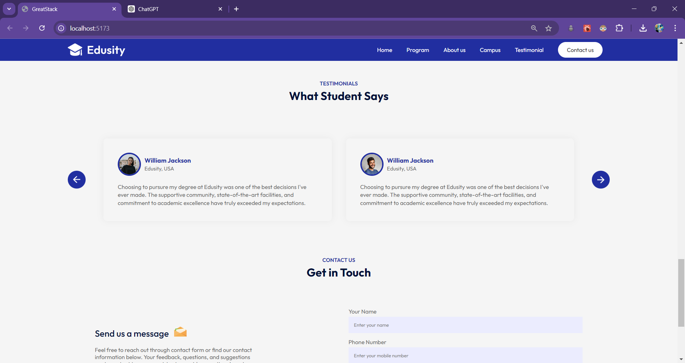

# Edusity

An educational website for showcasing university programs, campus, testimonials, and more.

## Table of Contents

- [Installation](#installation)
- [Usage](#usage)
- [Features](#features)
- [Project Structure](#project-structure)
- [Technologies Used](#technologies-used)
- [Screenshots](#screenshots)
- [Contributing](#contributing)
- [License](#license)
- [Contact](#contact)
- [Live Preview](#live-preview)

## Installation

To get started with the project, follow these steps:

1. Clone the repository:

   ```bash
   git clone git@github.com:Manglam11/Edusity.git

   ```

2. Navigate to the project directory:

   ```bash
   cd edusity

   ```

3. Install dependencies using npm or yarn:

   ```bash
   npm install

   ```

4. Start the development server:

   ```bash
   npm run dev

   ```

## Usage

Once the server is running, you can access the website at [http://localhost:5173](http://localhost:5173). The website includes various sections such as:

- **Hero Section**: Introduction to the university.
- **Programs**: Information about different academic programs offered.
- **About**: Details about the university’s mission and values.
- **Campus**: A gallery showcasing campus photos.
- **Testimonials**: Feedback from students.
- **Contact**: Contact form for inquiries.
- **Footer**: Links to terms of services and privacy policy.

## Features

- Responsive design.
- Dynamic navigation with React Scroll.
- Integration with Web3Forms for the contact form.
- Video player component.
- Image gallery for campus photos.

## Project Structure

Here is an overview of the project structure:

- `src/`
  - `assets/` – Contains images and video files.
  - `components/` – React components used in the project.
    - `About/`
    - `Campus/`
    - `Contact/`
    - `Footer/`
    - `Hero/`
    - `Navbar/`
    - `Programs/`
    - `Testimonials/`
    - `Title/`
    - `VideoPlayer/`
  - `App.jsx` – Main application component.
  - `index.css` – Global CSS styles.
  - `main.jsx` – Entry point for the React application.
- `public/`
  - `index.html` – HTML template for the application.
- `README.md` – This file.

## Technologies Used

- **Vite**: Fast build tool.
- **React**: JavaScript library for building user interfaces.
- **CSS**: Styling for the project.
- **Web3Forms**: Form handling for the contact page.

## Screenshots

- **Hero Section**: Introduction and welcoming message for the university.
  

- **Programs Section**: Overview of different academic programs offered.
  

- **About Section**: Information about the university's mission and values.
  

- **Campus Section**: Gallery showcasing campus photos.
  

- **Testimonials Section**: Feedback and reviews from students.
  

- **Contact Section**: Form and information for reaching out to the university.
  

## Contributing

Contributions are welcome! Please feel free to submit a Pull Request.

## License

This project is licensed under the MIT License.

## Contact

For more information, you can reach out at [manglamdubey11@gmail.com](mailto:your-email@example.com) or visit the project's [GitHub Repository](https://github.com/Manglam11/Edusity.git).

## Live Preview

Check out the live version of the website [here](http://live-preview-link.com).
